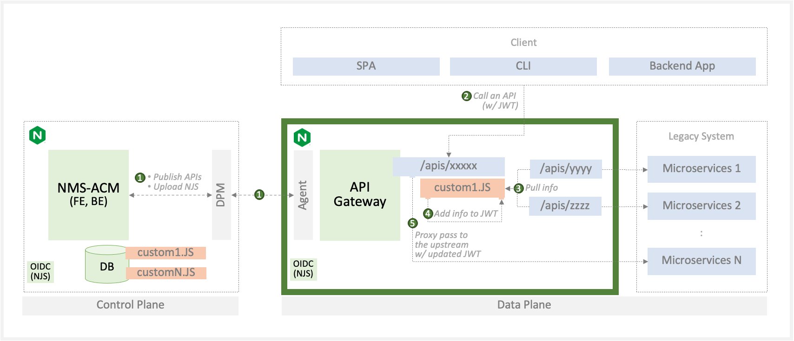

# custom-jwt

The default Customize JWT (NJS) supports the following workflow between NGINX and your Microservices. You could enhance the features based on your requirement using this template.

- 1. NGINX Management Suite (API Connectivity Manager) publish APIs and upload the NJS of custom JWT to the API gateway.
- 2. The Custom NJS (C-NJS) gets a JWT from a client.
- 3. The C-NJS pulls information from the number of Microservices.
- 4. The C-NJS add information to the JWT.
- 5. The C-NJS send the JWT to an upstream service.
